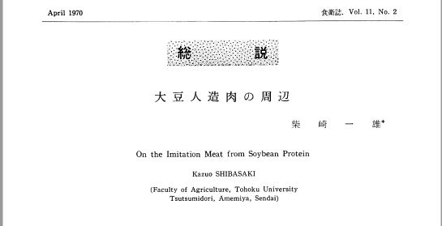

# __Profile__  
Hello, I work for a marketing company. I got involved in 'plant-based meat' at work and from there I got interested in cultured meat and food tech.  
I did a bit of an arts course at university (although I'm rusty!).  
By the way, I don't speak any English! English is also being studied in combination with.  

_ _ _

## __Interesting theme__  
### - __Alternative meats and food tech in the spotlight in recent years__  
Food tech (the art of using the latest technology to develop or discover entirely new ways of preparing food) is a very interesting subject!  
Food tech has received a great deal of attention recently, but new food production methods have been researched for some time.  
### - __Alternative proteins History of research and development__
Food and drink are essential for human survival, so research has continued due to external factors such as the food crisis caused by population growth, environmental problems, resource depletion and political instability.  
  
This image shows a text on meat alternatives, published in a specialist journal in April 1970.  
The title of the English version is "On the Imitation Meat from Soybean Proten."  
"Imitation Meat" is not an appetising name for food, but names such as "synthetic meat" and "artificial meat" may also have had a futuristic and positive connotation at the time.  
Surprisingly, in the 1970s, research and development of "petroleum protein", made from petroleum, and "natural gas protein", made from natural gas, was underway.   
This procedure is thought to be similar to the precision fermentation technology that is currently attracting attention.  
* Reference: (Although it is oil, not protein, the following is news of the world's first successful production of fried noodles using yeast oil produced by "oil yeast" (Lipomycesstarkeyi), which uses various sugars as raw materials and produces and accumulates oil and fat within the fungus).  
[Nissin Foods HD and Niigata University of Pharmacy and Pharmaceutical Sciences succeeded in the world's first fried noodles using yeast oil.(20220316)](https://news.nissyoku.co.jp/news/kubo20220314050059237?utm_source=mailmagazine&utm_medium=email&utm_campaign=daily)  
